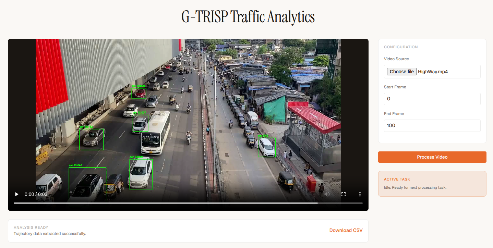
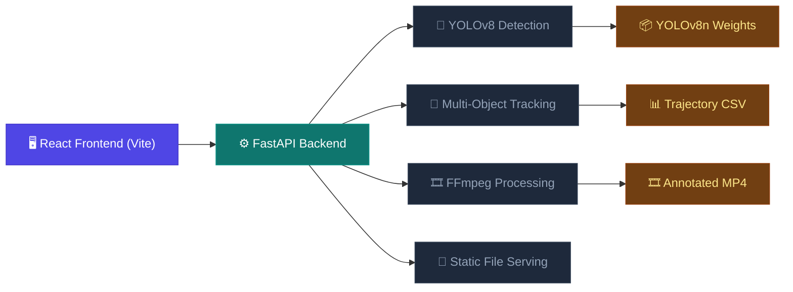

# G-TRISP Traffic Analytics

## Project Overview
This project provides an end-to-end solution for analyzing traffic videos. It detects vehicles, tracks them across frames, and extracts their trajectories into a structured CSV format. 

**Live Demo:** [https://traffic-analytics-sigma.vercel.app/](https://traffic-analytics-sigma.vercel.app/)

---

## System Architecture

---

## Technical Approach

The core of the system is a robust pipeline for traffic video analytics, focusing on vehicle detection, multi-object tracking, and trajectory data extraction.

### Core Tech Stack (Model & Processing)
- **Python**: The core programming language used for the implementation.
- **OpenCV**: Used for video loading, frame-by-frame processing, drawing annotations (bounding boxes, labels), and saving the output video.
- **Ultralytics YOLOv8**: Leveraged for its state-of-the-art object detection and tracking capabilities. The lightweight `yolov8n.pt` model is used to ensure efficient processing.
- **Pandas**: Used for structuring the extracted trajectory data into a tabular format and exporting it to CSV.
- **NumPy**: Used for efficient numerical operations and handling image data.

### Implementation Workflow

1.  **Model Loading**: Initialize the pretrained YOLOv8 model for detection and tracking.
2.  **Video Metadata Extraction**: Read video properties such as width, height, FPS, and total frame count using OpenCV.
3.  **Processing Range Definition**: Allow for processing specific video segments by defining start and end frame indices.
4.  **Frame-by-Frame Processing**:
    -   **Detection & Tracking**: For each frame, the YOLOv8 `track` method is invoked to detect vehicles and maintain persistent tracking IDs across frames.
    -   **Data Extraction**: Extract bounding box coordinates (`x1, y1, x2, y2`), tracking IDs, and class labels (e.g., car, bus, truck).
    -   **Centroid Calculation**: Compute the center point of each vehicle to represent its position in the trajectory.
    -   **Annotation**: Overlay bounding boxes and tracking IDs on the video frames.
5.  **Output Generation**:
    -   **Annotated Video**: Save the processed frames into a new video file.
    -   **Trajectory CSV**: Compile all recorded vehicle positions into a structured CSV file.

---

## System Architecture

The project is split into a modern full-stack application for ease of use and deployment.

### Backend (API)
- **Framework**: [FastAPI](https://fastapi.tiangolo.com/) for high-performance asynchronous API endpoints.
- **Processing**: Integrates the Python/OpenCV/YOLO pipeline to process uploaded videos on the fly.
- **Containerization**: [Docker](https://www.docker.com/) is used to ensure environment consistency and handle complex ML dependencies (OpenGL, FFmpeg).
- **Deployment**: Hosted on **Hugging Face Spaces** (Docker SDK) for optimized ML hardware and reliability.

### Frontend (User Interface)
- **Framework**: [React](https://reactjs.org/) with [Vite](https://vitejs.dev/) for a fast, responsive development experience.
- **Styling**: Modern, clean UI designed with standard CSS for maximum flexibility.
- **API Interaction**: [Axios](https://axios-http.com/) for handling video uploads and data retrieval.
- **Deployment**: Hosted on **Vercel** for global edge delivery and seamless CI/CD.

---

## How to Run Locally

### Backend
1. Navigate to `backend/`.
2. Install dependencies: `pip install -r requirements.txt`.
3. Run the server: `uvicorn app.main:app --reload`.

### Frontend
1. Navigate to `frontend/`.
2. Install dependencies: `npm install`.
3. Run the development server: `npm run dev`.
